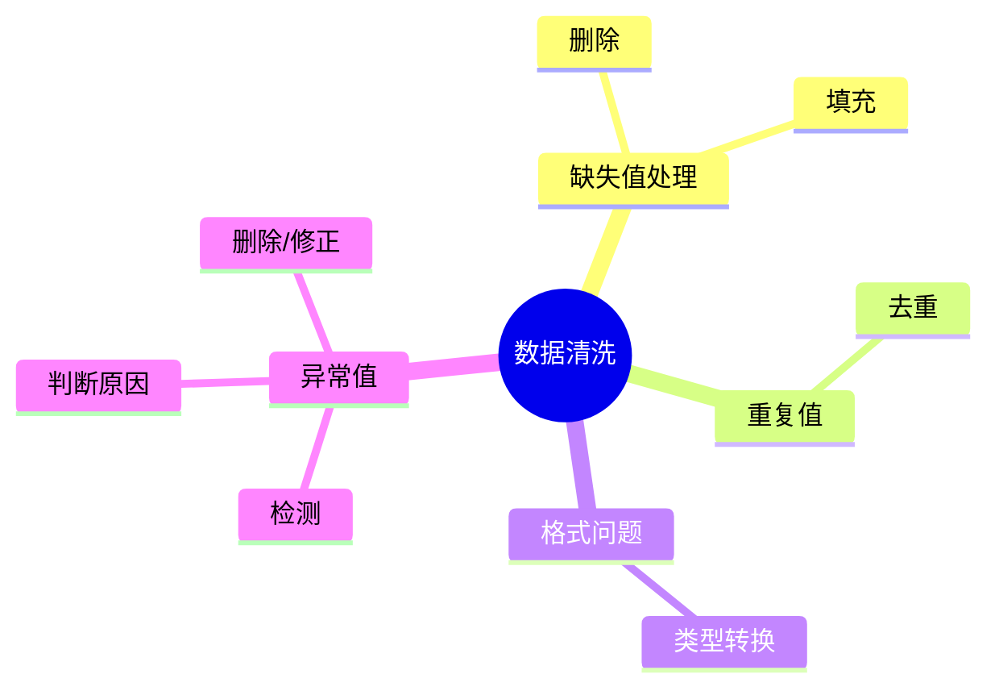

## 数据清洗

*数据清洗对原始数据进行处理，便于后续分析*

* 典型问题
>缺失值，重复值，异常值，格式不一致，错误数据

### 知识图谱



*使用pandas*
    
```python   
import pandas as pd

df=pd.read_csv("user.csv")
```
*检查数据*
```python
df.info()
df.describe()
```
*去重*

    df=df.drop_duplicates()

*处理缺失值*

    df["age"]=df["age"].fillna(df["age"].median())


